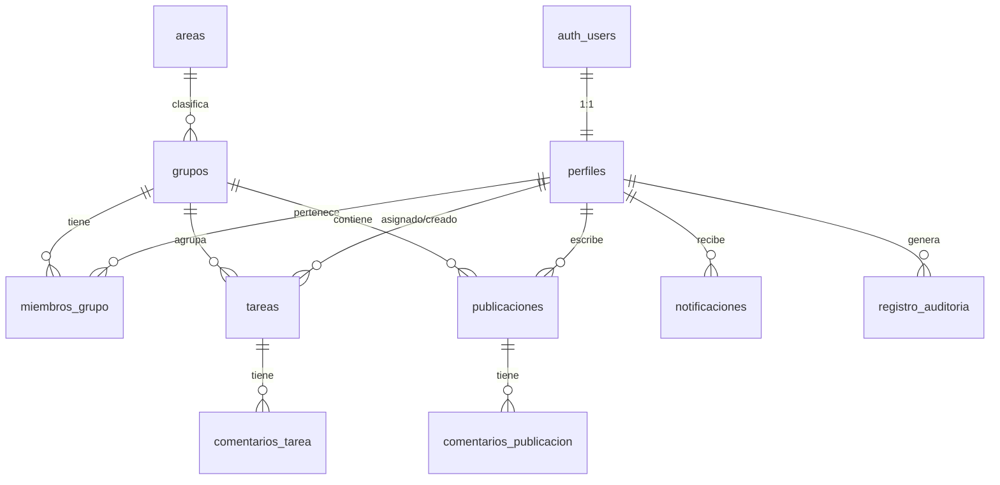

# Modelo de datos

El esquema completo está en `supabase/migrations/0001_init_schema.sql`. Aquí se documenta a alto nivel.

## Diagrama entidad-relación

## Entidades

### perfiles
Extiende `auth.users` (1:1). Se crea automáticamente al registrarse (trigger `on_auth_user_created`).
Campos: `nombre_completo`, `telefono`, `rol`, `verificado`, `organizacion`.

### areas
Catálogo de áreas operativas (clusters). Clave primaria = `area_clave` (enum). Sembrado en `0003_seed.sql`.

### grupos
Equipo operativo dentro de un área. Tiene un `lider_id` (perfil) y pertenece a un `area`.

### miembros_grupo
Relación N:N entre `grupos` y `perfiles`. PK compuesta `(grupo_id, perfil_id)` + `rol_en_grupo`.

### tareas
Unidad de trabajo. Estado, prioridad, `grupo_id`, `asignado_a`, `creado_por`, ubicación (`lat`/`lng`), `vence_en`. Triggers: `actualizado_en` automático y notificación al asignar.

### comentarios_tarea
Hilos de coordinación sobre una tarea.

### publicaciones
Tablón. `grupo_id` nulo = tablón general. `sensibilidad` controla la visibilidad vía RLS.

### comentarios_publicacion
Respuestas a una publicación.

### notificaciones
Avisos por usuario (`destinatario_id`), con `tipo`, `leida`, `enlace`.

### registro_auditoria
Rastro de acciones sobre información sensible. Lectura solo para coordinación.

## Enumerados

| Tipo | Valores |
|------|---------|
| `rol_usuario` | admin, coordinador, lider_grupo, voluntario, observador |
| `area_clave` | salud, agua_saneamiento, refugio, alimentacion, logistica, busqueda_rescate, telecomunicaciones, proteccion, gestion_informacion |
| `estado_tarea` | pendiente, asignada, en_progreso, bloqueada, completada, cancelada |
| `prioridad` | baja, media, alta, critica |
| `nivel_sensibilidad` | publica, interna, restringida, confidencial |

## Notas de diseño

- **Borrados**: `on delete cascade` en dependencias (membresías, comentarios) y `set null` donde conviene conservar el registro (p. ej. tarea cuyo grupo se elimina).
- **Geolocalización**: por simplicidad se usan `lat`/`lng` (double). Para consultas espaciales (radio, cercanía) se recomienda migrar a **PostGIS** en fase 2.
- **Índices**: creados para los filtros más comunes (estado de tarea, grupo, destinatario de notificación).
- **Tipos generados**: tras aplicar migraciones, `pnpm db:types` mantiene `database.types.ts` sincronizado con esta estructura.
