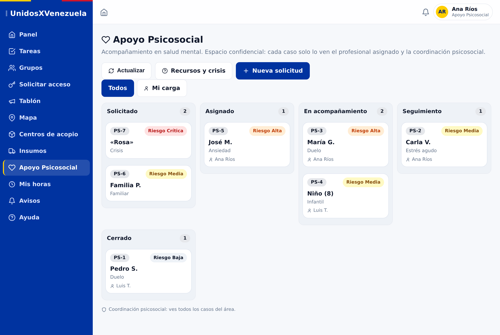
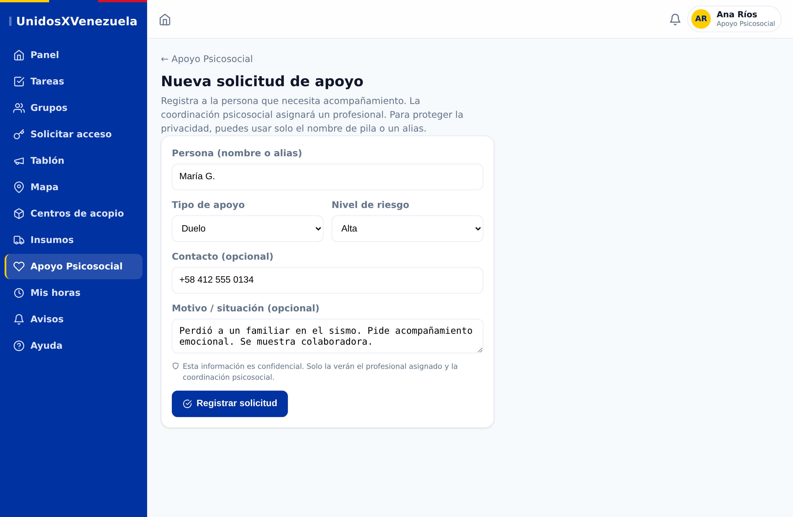
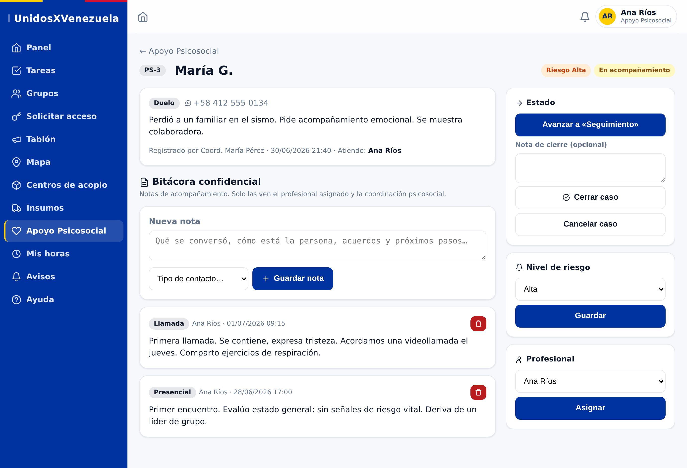
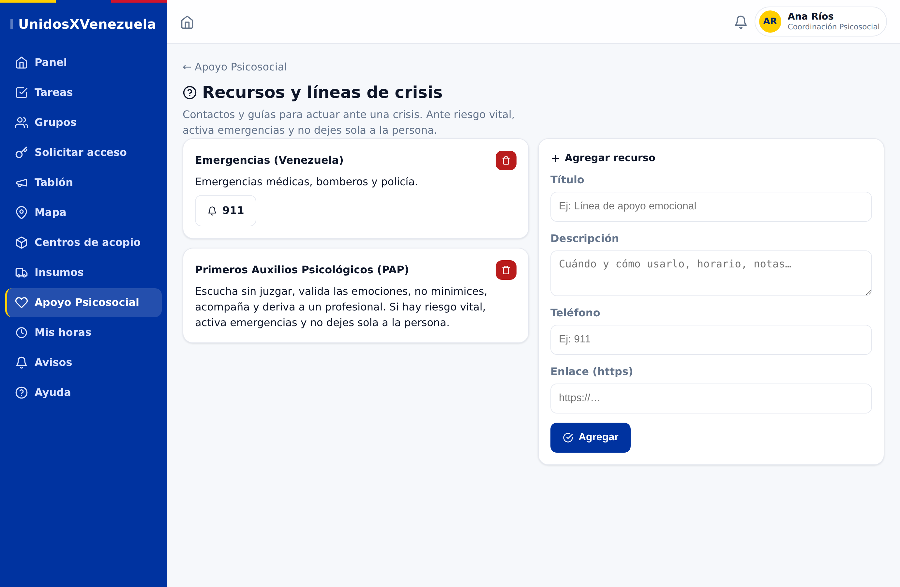
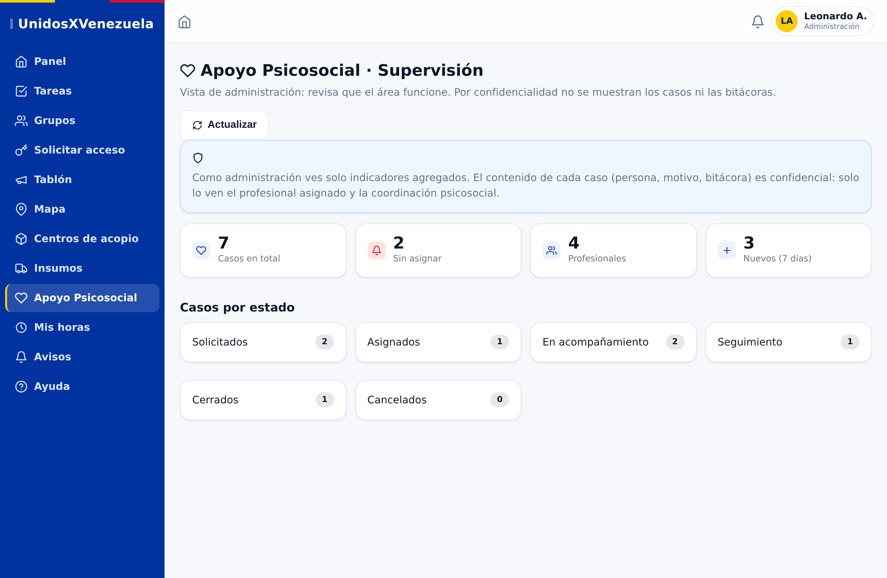

# Guía de uso — Área de Apoyo Psicosocial

Guía práctica del área de salud mental de UnidosXVenezuela: para qué sirve, quién
hace qué y cómo se usa cada pantalla. Pensada para compartir con el equipo.

> **Principio de confidencialidad.** Cada caso y su bitácora **solo** los ven el
> **profesional asignado** y la **coordinación psicosocial**. **No** los ve el
> administrador ni la coordinación general. Esto lo hace cumplir la base de datos
> (RLS), no la interfaz. Es coherente con el **secreto profesional**.

---

## Roles del área

| Rol | Qué puede hacer |
|-----|-----------------|
| **Apoyo Psicosocial** | Profesional/voluntario que acompaña. Ve y atiende los casos **asignados a él**, escribe en la bitácora, avanza el estado y cierra. |
| **Coordinación Psicosocial** | Coordina el área: ve **todos** los casos, asigna profesionales, gestiona recursos y puede eliminar casos. |
| **Administración** | Solo **supervisión**: indicadores agregados para comprobar que el área funciona. **No** ve casos ni bitácoras. |

Los roles los asigna un admin/coordinación desde **Administración → Usuarios**.
Que un profesional sea *voluntario* no cambia nada: se le da el rol **Apoyo
Psicosocial**, no el rol genérico "Voluntario".

---

## Flujo de un caso

```
Solicitado → Asignado → En acompañamiento → Seguimiento → Cerrado
                                                         ↘ Cancelado
```

1. **Solicitado** — se registra a la persona. Avisa a la coordinación psicosocial.
2. **Asignado** — la coordinación asigna un profesional (o el profesional toma un caso). Le avisa.
3. **En acompañamiento / Seguimiento** — el profesional registra cada contacto en la bitácora.
4. **Cerrado** (con nota de cierre) o **Cancelado**.

El **nivel de riesgo** (Baja / Media / Alta / Crítica) se puede ajustar en
cualquier momento y ayuda a priorizar.

---

## 1) Tablero de casos (equipo psicosocial)

Al entrar a **Apoyo Psicosocial**, el equipo ve el tablero por estado. Cada
tarjeta muestra el código (PS-#), la persona (nombre o alias), el tipo de apoyo,
el **nivel de riesgo** y el profesional que atiende. La pestaña **«Mi carga»**
filtra solo los casos asignados a ti.



---

## 2) Registrar una solicitud

Con **«Nueva solicitud»** se registra a la persona que necesita acompañamiento.
Para proteger la privacidad se puede usar **solo el nombre de pila o un alias**.
Se indica el tipo de apoyo, el nivel de riesgo, un contacto opcional y el motivo.
Al guardar, la coordinación psicosocial recibe el aviso para asignarlo.



---

## 3) Detalle del caso y bitácora confidencial

Es el espacio de trabajo del profesional:

- **Datos del caso** (tipo, contacto, motivo, quién lo registró y quién atiende).
- **Bitácora confidencial** — se anota cada contacto (llamada, presencial,
  mensaje…). **Solo** la ven el profesional asignado y la coordinación psicosocial.
- Panel derecho: **avanzar de estado**, **cerrar** (con nota de cierre) o
  **cancelar**; ajustar el **nivel de riesgo**; y **asignar** el profesional
  (la coordinación).



---

## 4) Recursos y líneas de crisis

Contactos y guías para actuar ante una crisis (p. ej. Emergencias **911** y una
guía de **Primeros Auxilios Psicológicos**). La coordinación psicosocial los edita
y agrega los teléfonos reales de la zona.

> Ante **riesgo vital**: activar emergencias, no dejar sola a la persona y escalar
> de inmediato a la coordinación psicosocial.



---

## 5) Supervisión para administración (sin ver los casos)

La administración entra al área y ve un **panel de indicadores** para comprobar
que funciona: total de casos, **casos por estado**, cuántos están **sin asignar**
(backlog), nº de **profesionales** y **nuevos de los últimos 7 días**. **Nunca**
ve nombres, motivos ni bitácoras, y no puede abrir ningún caso.



---

## Puesta en marcha

1. Un admin promueve a la primera persona a **Coordinación Psicosocial** (*Administración → Usuarios*).
2. Esa coordinación asigna **Apoyo Psicosocial** al resto del equipo.
3. La coordinación completa **Recursos y líneas de crisis** con los teléfonos reales.

> Las capturas de esta guía son maquetas fieles con datos de ejemplo; la app real
> se ve igual con tus datos.
